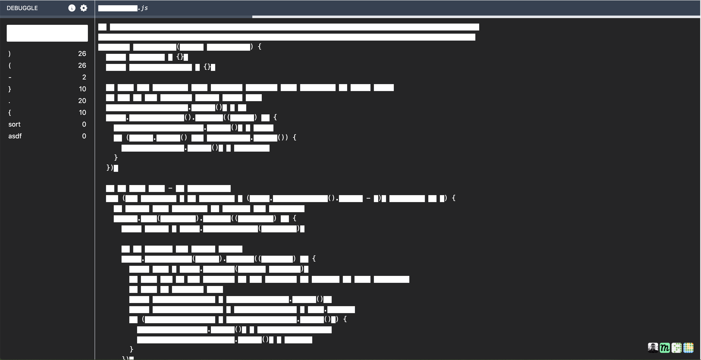

# Debuggle

[Redactle](https://www.redactle.com/#) for nerds. Find a redacted source code by revealing keywords. The goal is to find the filename. 

### Go OSS
Since this project is mainly targeted at developers, I decide to open  source the code.

Bear in mind, that I wrote the page in a few hacking sessions with the goal to put the project online as fast as possible.

For now, I hand-pick the algorithms to come and add them here. GitHub actions trigger a script, which picks the next puzzles, changes the puzzle.tsx file  and commits the changes. [Debuggle.net](https://debuggle.net/) runs on CloudFlare pages, which publishes  a new version upon change.

### Author
This is a project by [Kiru](https://kiru.io/). Checkout some other projects: 

- [Mathle](https://mathlegame.com/)
- [Reversle](https://reversle.net/)
- [Learnle](https://learnle.net/)

### Questions?
If you have any suggestions or questions, feel free to open an issue. 
